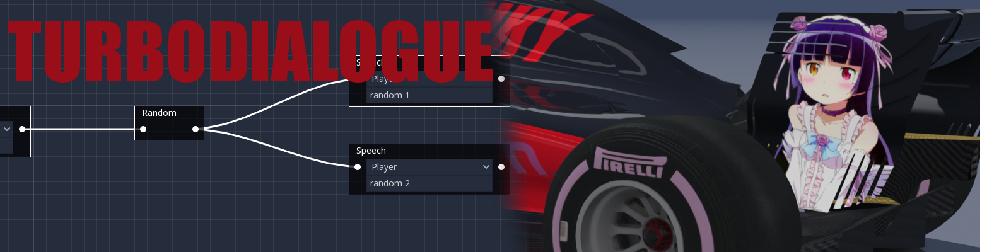

# TurboDialog, a generic dialog plugin for the godot engine

# What this is and isn't

- This is a generic node system for the godot engine, it takes charge of loading and saving nodes for you.
- This was menat originally for dialogues, however it can be modified to do whatever you want

- This isn't a full dialogue system, it doesn't render dialogues for you, however it allows you to easily modify it for your own use.

# Usage

In the ERO-ONE version of this plugin we have an extra variable in the DialogTree itself called DialogRenderer, which takes charge of showing text and other interactions, so you are expected to add your own there too.

I have left in the bits of code that are specific to ERO-ONE as comments, you may want to check them for inspiration

Add a new ERODialogTree to your scene, then add a new ERODialog resource to the dialog property using the inspector, Godot doesn't allow us to define defaults for custom resources yet.

# Creating your own nodes

All your node's scripts must be placed in the res://addons/moe.ero-one.dialog/Nodes

## Inheritance
Inherit from res://addons/moe.ero-one.dialog/Nodes/EROTreeNode.gd, or else it won't work.

## Serialization
If your node stores data you must make to_dict() and from_dict() methods, check the example Speech node to check how this works.

Please keep in mind \_ready() doesn't run before from_dict(), so you may want to change how your UI initialization is done.

## Making your nodes available in the graph

Edit DIALOG_NODE_SCRIPTS in res://addons/moe.ero-one.dialog/plugin.gd and add your node's script.

## Node functionality

### Making your node do things
When your node is supposed to start working, execute_node is called, you get as arguments the ERODialogTree that's calling the node and the next connections down the tree.

### Jumping to a different node
ERODialogTree has a method called execute_node(), it takes the node name you want to execute as an argument, you can get your connected nodes from the connections argument in your node's execute_node() method, check the RandomChoiceNode for an example on how you can control this behaviour.

## Changing your node's behaviour in the graph

### Multinode
If your node can only be connected to a single node set allows_multinode to false, the InputNode is an example of this.

### Uniqueness
If you want there to be only one node of the type in the graph, make is_unique() return true, check the InputNode for an example on how to do this.
